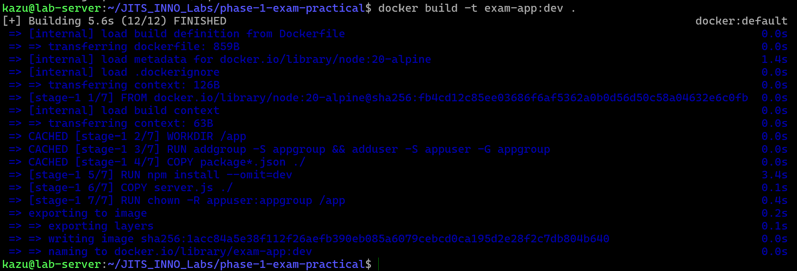
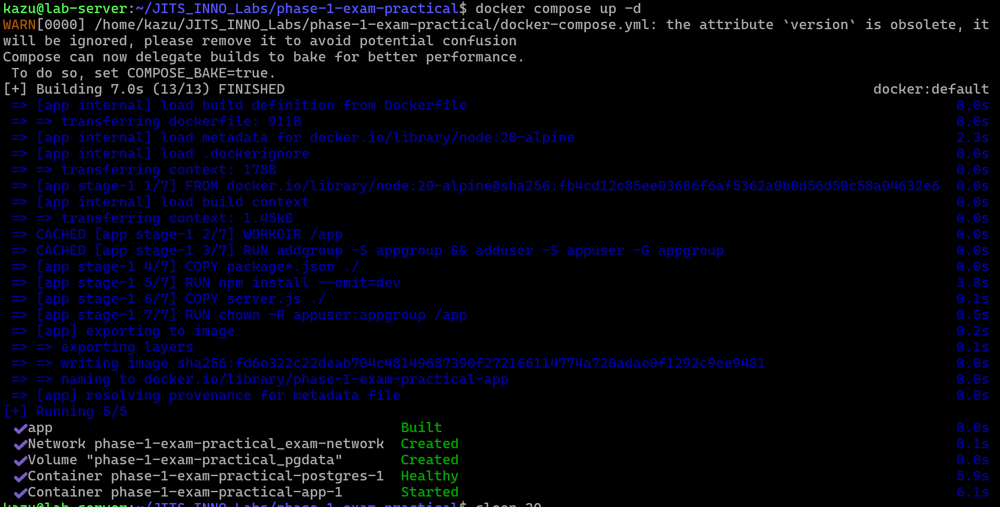
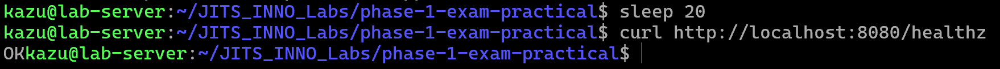
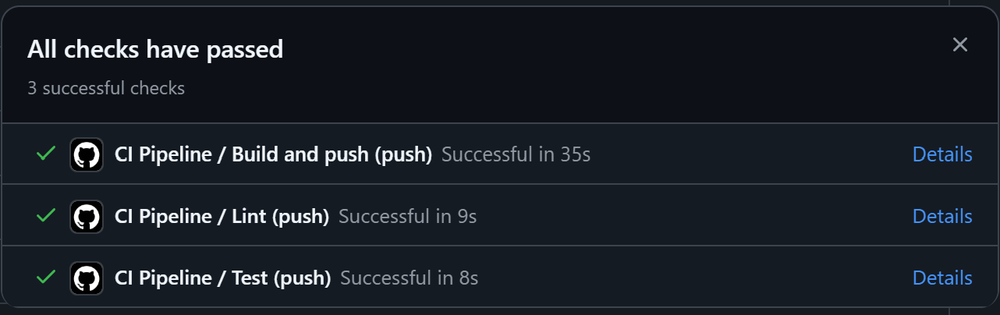
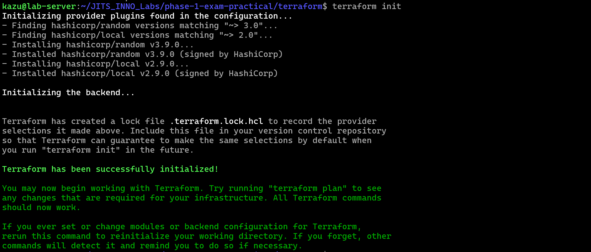
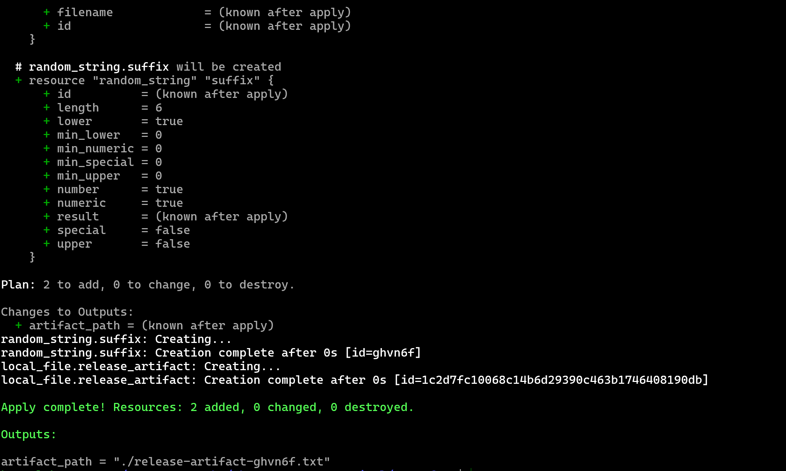
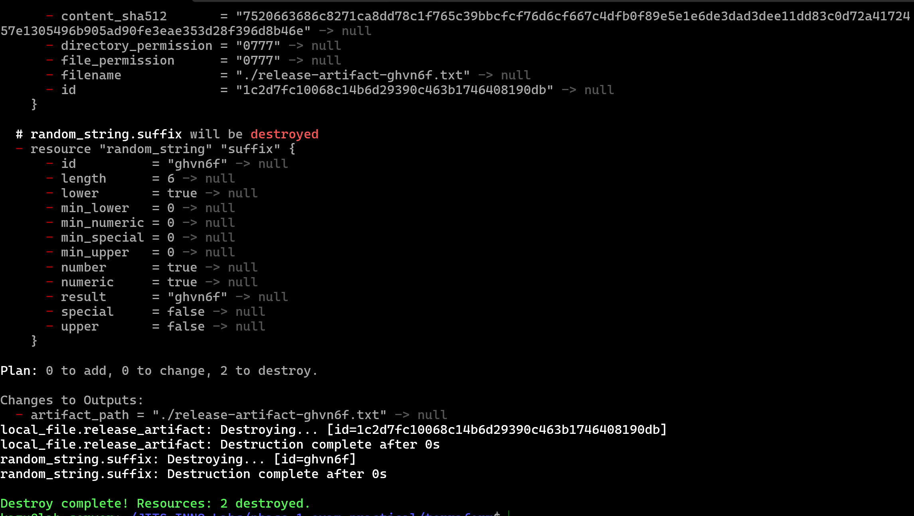
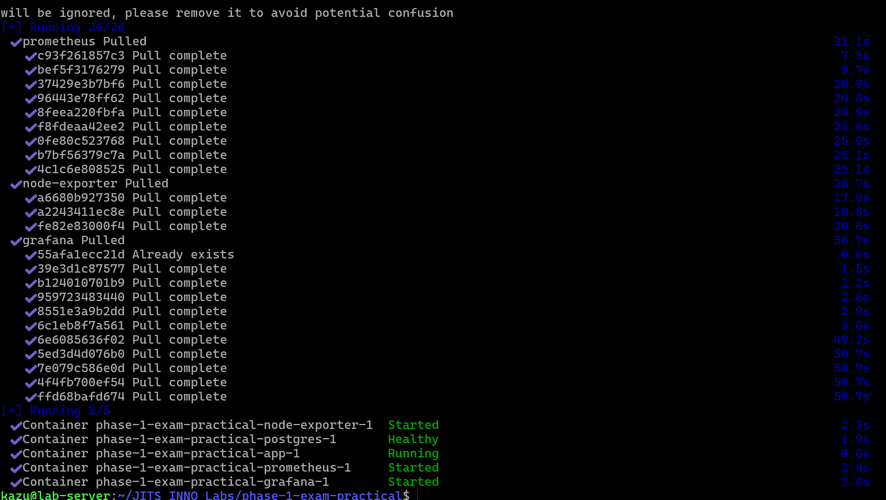
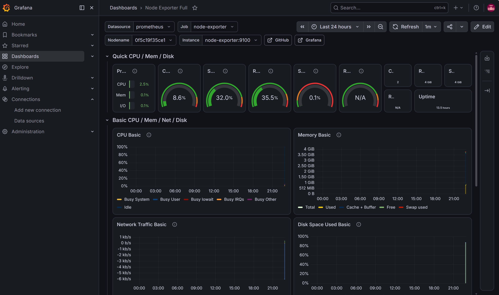

# Phase 1 - Exam - Practical

Đề bài tại: [https://github.com/DevSecOps-Jits/DevSecOps-Training/blob/main/exam/phase-1-practical.md](https://github.com/DevSecOps-Jits/DevSecOps-Training/blob/main/exam/phase-1-practical.md)

Chi tiết báo cáo bài thi thực hành và hướng dẫn khởi chạy vui lòng xem tại repo chính thức:
[https://github.com/KwangZung/devops-training-NguyenQuangDung/tree/phase-1/exam/Exam/phase-1-practical](https://github.com/KwangZung/devops-training-NguyenQuangDung/tree/phase-1/exam/Exam/phase-1-practical)

# Task Submission Template

> Mỗi task = 1 thư mục con + 1 PR/MR riêng. Copy template này vào `README.md` của task.

## Task: `Phase 1 / Exam / Practical`

- **Intern**: `Nguyễn Quang Dũng`
- **Phase / Week / Day**: `Phase 1 / Exam`
- **Branch**: `phase-1/exam`
- **Submitted at**: `2026-07-03 23:00` (timezone +07)
- **Time spent**: `6h`

## 1. Mục tiêu
Thiết lập quy trình triển khai ứng dụng cơ bản (Mini Deploy Pipeline) thông qua việc đóng gói ứng dụng, cấu hình hệ thống đa dịch vụ, khởi tạo luồng tích hợp liên tục và cấu hình hạ tầng.

## 2. Cách chạy
```bash
git clone https://github.com/KwangZung/phase-1-exam-practical.git
cd phase-1-exam-practical

# Task 1: Kiểm tra bản dựng Docker
docker build -t exam-app:dev .

# Task 2: Khởi động hệ thống và kiểm tra trạng thái
cp .env.example .env
docker compose up -d
curl http://localhost:8080/healthz

# Task 4: Khởi tạo và triển khai hạ tầng
cd terraform
terraform init
terraform apply -auto-approve
terraform destroy -auto-approve

# Task 5: Observability
docker compose up -d
# Truy cập vào trang grafana theo link http://localhost:3000
```

## 3. Kết quả

Mã nguồn ứng dụng được lưu tại repo:
[https://github.com/KwangZung/phase-1-exam-practical](https://github.com/KwangZung/phase-1-exam-practical)

### Task 1: Containerize
**Cách thực hiện:**
- Thiết lập tệp `server.js` xử lý phản hồi yêu cầu sức khỏe hệ thống (healthcheck) kèm theo việc khởi tạo đối tượng kết nối cơ sở dữ liệu dựa trên biến môi trường.
- Thiết lập tệp `package.json` với kịch bản phục vụ quá trình tự động kiểm thử.
- Khai báo tệp `.dockerignore` nhằm bỏ qua các tập tin dư thừa, tối ưu hóa kích thước ngữ cảnh bản dựng.
- Viết tệp `Dockerfile` sử dụng kỹ thuật xây dựng đa giai đoạn, khởi tạo một nhóm và người dùng không chứa quyền hệ thống (non-root), đồng thời áp dụng lệnh `HEALTHCHECK` định kỳ.

**Kết quả đạt được:**



### Task 2: docker-compose 2 service 
**Cách thực hiện:**
- Khai báo tệp tin `.env.example` cung cấp định dạng chuẩn cho các biến môi trường cấu hình cơ sở dữ liệu.
- Copy `.env` từ `.env.example`
- Xây dựng cấu hình `docker-compose.yml` định nghĩa hai dịch vụ cốt lõi: ứng dụng `app` và cơ sở dữ liệu `postgres`. 
- Cấu hình chỉ thị `depends_on` với điều kiện `service_healthy`, yêu cầu dịch vụ ứng dụng đợi cơ sở dữ liệu hoạt động ổn định trước khi khởi tạo.
- Cấu hình liên kết volume cho dịch vụ `postgres` để đảm bảo dữ liệu bền vững.

**Kết quả đạt được:**
- Hệ thống đa dịch vụ khởi chạy hoàn tất.
- Điểm kiểm tra phản hồi thành công mã trạng thái `HTTP 200 OK`.




### Task 3: Tự động hóa CI Pipeline
**Cách thực hiện:**
- Thiết lập tệp cấu hình `.github/workflows/ci.yml` định nghĩa quy trình tích hợp liên tục.
- Phân chia quy trình thành 3 luồng công việc độc lập: `lint`, `test`, và `build-and-push`, liên kết tuần tự thông qua chỉ thị `needs`.
- Cấu hình kích hoạt trên toàn bộ các nhánh (mọi sự kiện push) nhằm kiểm soát chất lượng mã nguồn, tuy nhiên giới hạn thao tác đẩy ảnh lên kho lưu trữ (push GHCR) chỉ áp dụng cho nhánh `main`.
- Cấu hình bước xác thực tài khoản với GitHub Container Registry tự động qua mã thông báo `GITHUB_TOKEN`.
- Thiết lập trích xuất mã định danh tự động (`sha-<short>` và `latest`) thông qua hành động `docker/metadata-action`.
- Tích hợp bộ nhớ đệm đa lớp (NPM cache và Docker cache backend) tối ưu hóa thời gian thực thi.
- Khắc phục các rào cản nền tảng thông qua việc khởi tạo tệp `package-lock.json` và cấu hình môi trường hỗ trợ `docker-container` driver thông qua `setup-buildx-action`.

**Kết quả đạt được:**
- Kịch bản CI thực thi thành công toàn bộ các luồng.
- File image được tự động đóng gói và đẩy lên repo.



### Task 4: IaC nhỏ
**Cách thực hiện:**
- Thiết lập tệp cấu hình `main.tf` tích hợp các khối nhà cung cấp `local` và `random`.
- Ứng dụng tài nguyên `random_string` để sinh chuỗi định danh ngẫu nhiên gắn vào tệp.
- Khởi tạo tệp tin giả lập đối tượng phát hành (release artifact) thông qua tài nguyên `local_file`, đảm bảo khả năng thực thi độc lập tại môi trường cục bộ thay thế cho kho lưu trữ đám mây.
- Cập nhật tệp `.gitignore` loại trừ hoàn toàn các tập tin trạng thái cục bộ nhạy cảm (như thư mục `.terraform`, `.tfstate`) nhằm kiểm soát ngvhiêm ngặt tính bảo mật.

**Kết quả đạt được:**
- `terraform init` và `terraform apply`



- `terraform destroy`



### Task 5: Observability
**Cách thực hiện:**
- Bổ sung tệp cấu hình `prometheus.yml` định nghĩa chu kỳ thu thập dữ liệu liên tục từ mục tiêu `node-exporter:9100`.
- Mở rộng tệp `docker-compose.yml` tích hợp 3 dịch vụ giám sát lõi: `prometheus`, `grafana`, và `node-exporter`. Cấu hình đồng bộ hóa các tệp dữ liệu vào không gian của Prometheus và ràng buộc Grafana khởi chạy sau khi Prometheus ở trạng thái sẵn sàng.
- Truy cập giao diện quản trị Grafana, liên kết nguồn cấp dữ liệu Prometheus thông qua địa chỉ mạng nội bộ.
- Import bảng điều khiển giám sát Node Exporter (ID: 1860) giúp theo dõi chi tiết hiệu năng phần cứng máy chủ (CPU, RAM).
- Trích xuất cấu hình bảng điều khiển dưới định dạng JSON và lưu trữ vào kho mã nguồn: [dashboard.json](https://github.com/KwangZung/phase-1-exam-practical/blob/main/dashboard.json).

**Kết quả đạt được:**
- Sau khi chạy `docker compose up -d`

- Giao diện dashboard trên grafana


## 4. Khó khăn & cách giải quyết
- **Lỗi thiếu tệp khóa bộ nhớ đệm (Cache) trong CI:** Quá trình tự động cài đặt môi trường Node.js trên GitHub Actions thất bại do hệ thống không tìm thấy tệp `package-lock.json` để làm khóa lưu trữ bộ đệm.
  → *Cách giải quyết:* Thực thi lệnh `npm install` tại môi trường cục bộ để tạo tệp `package-lock.json` và bổ sung vào hệ thống quản lý phiên bản.
- **Lỗi không hỗ trợ xuất bộ đệm Docker (Cache export):** Kịch bản đóng gói báo lỗi do trình điều khiển mặc định của hệ thống Docker trên GitHub Runner không hỗ trợ tính năng xuất bộ đệm (`type=gha`).
  → *Cách giải quyết:* Bổ sung hành động `docker/setup-buildx-action` trước bước thực thi bản dựng nhằm kích hoạt trình điều khiển `docker-container`, hỗ trợ đầy đủ tính năng lưu trữ tiên tiến.
- **Lỗi bảo mật khi cài đặt Terraform qua Snap:** Hệ thống máy chủ từ chối cài đặt gói phân phối của Terraform do yêu cầu quyền truy cập sâu hệ thống (classic confinement), vi phạm chính sách ranh giới an toàn (sandbox) mặc định.
  → *Cách giải quyết:* Bổ sung tham số `--classic` vào lệnh cài đặt (`sudo snap install terraform --classic`) để cho phép thực thi ở đặc quyền mở rộng.

## 5. Reference
- Đã đọc gì để làm task này (link cụ thể, không vague).

## 6. Self-check
- [x] Code chạy được trên máy sạch.
- [x] README có hướng dẫn run lại.
- [x] Không hard-code secret.
- [x] Commit message theo Conventional Commits.
- [x] Đã review lại code 1 lượt.

## 7. Điểm có thể cải thiện (What I'd improve given more time)
- Thiết lập giới hạn tài nguyên (CPU/Memory limits) cho các bộ chứa trong `docker-compose.yml` để tránh tình trạng chiếm dụng chéo (noisy neighbor).
- Thay vì sử dụng tệp `.env` đơn giản, áp dụng giải pháp quản lý bí mật tập trung (như HashiCorp Vault) hoặc GitHub Secrets có mã hóa trong luồng CI.
- Mở rộng Terraform để cung cấp trọn bộ hạ tầng thực tế trên Cloud (như VPC, EKS, RDS) kèm theo tệp tin trạng thái (remote state) thay vì lưu trữ cục bộ.
- Bổ sung công cụ rà quét lỗ hổng bảo mật (Trivy) trực tiếp vào luồng GitHub Actions CI trước khi đẩy ảnh lên kho lưu trữ.